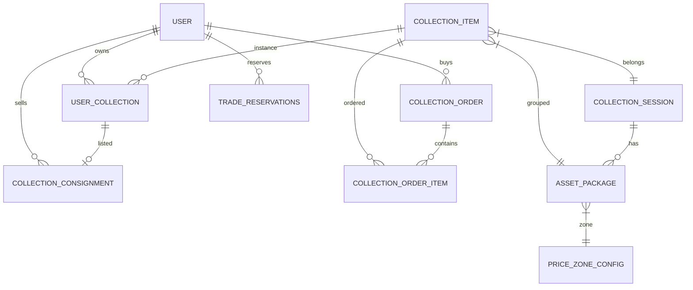

# 数据库架构分析报告

## 分析日期：2025-12-28

---

## 一、现有表清单

根据代码和迁移脚本分析，系统共有以下主要表（前缀：`ba_`）：

### 核心业务表

| 表名 | 功能 | 说明 |
|-----|------|------|
| `user` | 用户账户 | 包含多个余额字段（混乱） |
| `collection_item` | 藏品商品 | 商品定义 |
| `collection_session` | 交易场次 | 场次时间配置 |
| `collection_consignment` | 寄售记录 | 用户寄售挂单 |
| `user_collection` | 用户持仓 | 用户拥有的藏品 |
| `collection_order` | 藏品订单 | 购买订单主表 |
| `collection_order_item` | 订单明细 | 订单-藏品关联 |
| `collection_matching_pool` | 撮合池 | 买单队列 |
| `trade_reservations` | 预约记录 | 盲盒预约冻结 |
| `asset_package` | 资产包 | 场次+分区的商品分组 |
| `price_zone_config` | 价格分区 | 价格区间配置 |

### 财务日志表

| 表名 | 功能 |
|-----|------|
| `user_money_log` | 资金变动日志 |
| `user_activity_log` | 用户活动日志（复合用途） |
| `user_score_log` | 积分变动日志 |

### 其他业务表

| 表名 | 功能 |
|-----|------|
| `user_consignment_coupon` | 寄售券 |
| `user_withdraw` | 提现记录 |
| `user_sign_in` | 签到记录 |
| `user_old_assets_unlock` | 旧资产解锁 |
| `invite_code` | 邀请码 |
| `invite_record` | 邀请记录 |
| `finance_order` | 财务产品订单 |
| `recharge_order` | 充值订单 |
| `shop_order` | 商城订单 |
| `shop_order_item` | 商城订单明细 |

---

## 二、架构问题分析

### 🔴 严重问题

#### 1. `user` 表字段过多且含义混乱

```
余额相关字段（至少8个）：
- money            -> 总资产（派生值，冗余）
- balance_available -> 专项金
- withdrawable_money -> 提现余额  
- score            -> 消费金/积分
- service_fee_balance -> 确权金
- static_income    -> 静态收益（已废弃?）
- pending_activation_gold -> 待激活金
- green_power      -> 绿色能量/算力
- service_fee_balance -> 确权金（冗余?）
- consignment_coupon -> 寄售券数量（应在独立表）
```

**问题**：
- 字段命名不一致（money/balance/gold混用）
- `money` 是派生值却保留在表中
- `service_fee_balance` 和 `service_fee_balance` 似乎重复
- 券类字段不应放在用户主表

---

#### 2. 寄售/持仓状态双表冗余

`collection_consignment.status` 和 `user_collection.consignment_status` 需要同步维护，容易不一致。

```sql
-- collection_consignment.status
0 = 已取消
1 = 寄售中
2 = 已售出
3 = 已下架/流拍

-- user_collection.consignment_status
0 = 未寄售
1 = 寄售中
2 = 已售出
```

**建议**：只在 `collection_consignment` 维护状态，`user_collection` 通过关联查询。

---

#### 3. 价格字段分散

价格信息散落在多个表：
- `collection_item.price` - 商品当前价格
- `user_collection.price` - 用户买入价格  
- `collection_consignment.price` - 寄售价格
- `collection_consignment.original_price` - 原购买价格

**问题**：价格增值后各表不同步。

---

#### 4. 活动日志表滥用

`user_activity_log` 表被用于多种用途：
- 资金变动记录
- 权益交割标记
- 寄售操作记录
- 代理佣金记录

**建议**：按业务类型拆分为独立日志表。

---

### 🟡 需优化问题

#### 5. 缺少外键约束

所有表关联通过业务代码维护，无数据库级外键，存在数据一致性风险。

#### 6. 索引缺失

部分高频查询字段缺少索引:
- `collection_consignment.user_collection_id`
- `user_collection.item_id`
- `collection_matching_pool.session_id`

#### 7. 命名不规范

- `collection_item` vs `user_collection` 命名风格不一致
- `ba_` 前缀使用不完全

---

## 三、表关系图



---

## 四、重构建议

### 短期优化（低风险）

1. **添加缺失索引**
2. **清理废弃字段注释**  
3. **统一时间字段类型**（int→int unsigned）

### 中期重构

1. **用户余额拆表**
   ```sql
   -- 新建 user_wallet 表
   CREATE TABLE user_wallet (
     user_id INT PRIMARY KEY,
     balance_available DECIMAL(12,2),
     withdrawable_money DECIMAL(12,2),
     service_fee_balance DECIMAL(12,2),
     score INT
   );
   ```

2. **合并寄售状态管理**
   - 移除 `user_collection.consignment_status`
   - 通过 JOIN 查询获取状态

3. **活动日志拆分**
   - `user_trade_log` - 交易日志
   - `user_rights_log` - 权益日志
   - `user_commission_log` - 佣金日志

### 长期考虑

1. 引入数据库迁移工具（如 Phinx）
2. 添加外键约束
3. 考虑读写分离架构
