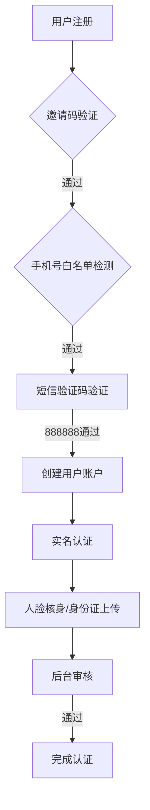
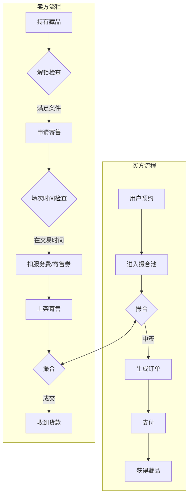
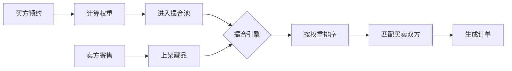
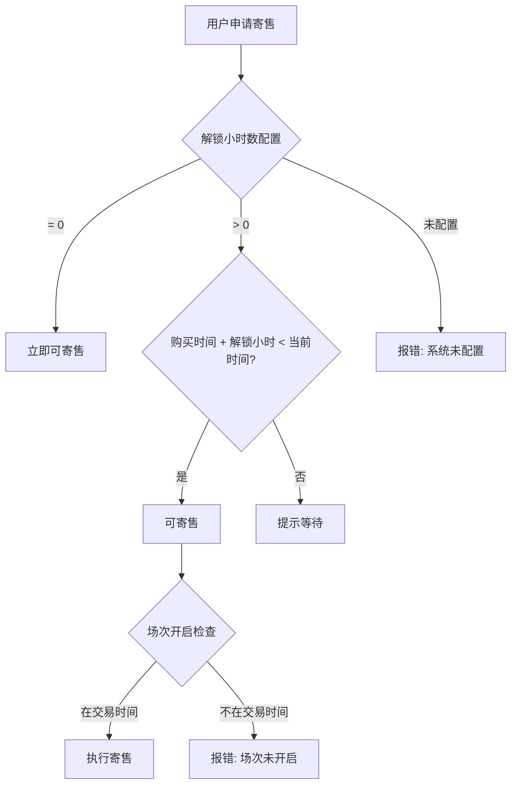

# 系统架构文档

## 一、系统概述

本系统是一个**数字藏品交易平台**，支持用户购买、寄售、撮合交易数字藏品，同时集成理财产品、积分商城等功能模块。

---

## 二、核心业务流程

### 1. 用户注册与认证流程



**关键接口**：
- `POST /api/User/checkIn` - 登录/注册
- `POST /api/User/submitRealName` - 实名认证
- `POST /api/Account/retrievePassword` - 找回密码

---

### 2. 藏品交易核心流程



**关键接口**：
- `POST /api/collectionItem/bidBuy` - 预约购买（进入撮合池）
- `POST /api/collectionItem/consign` - 申请寄售
- `POST /api/collectionItem/buy` - 直接购买
- `GET /api/collectionItem/matchingPool` - 撮合池列表

---

### 3. 撮合机制



**权重计算规则**：
- 权重 = 算力使用量 × 20
- 权重越高，中签概率越大

---

### 4. 寄售解锁检查



---

## 三、数据库设计

### 1. 用户相关表

#### ba_user（用户表）
| 字段 | 类型 | 说明 |
|------|------|------|
| id | int | 用户ID |
| username | varchar(32) | 用户名 |
| mobile | varchar(11) | 手机号 |
| password | varchar(255) | 登录密码 |
| pay_password | varchar(255) | 交易密码 |
| money | decimal(10,2) | 总资产 |
| balance_available | decimal(10,2) | 可用余额 |
| withdrawable_money | decimal(10,2) | 可提现金额 |
| service_fee_balance | decimal(10,2) | 服务费余额 |
| score | decimal(10,2) | 消费金 |
| green_power | decimal(10,2) | 绿色算力 |
| consignment_coupon | int | 寄售券数量 |
| inviter_id | int | 邀请人ID |
| real_name_status | tinyint | 实名状态(0=未实名,1=待审核,2=已通过,3=已拒绝) |
| user_type | tinyint | 用户类型(0=普通,1=达人) |

---

### 2. 藏品相关表

#### ba_collection_item（藏品表）
| 字段 | 类型 | 说明 |
|------|------|------|
| id | int | 藏品ID |
| session_id | int | 所属场次ID |
| title | varchar(255) | 藏品名称 |
| image | varchar(255) | 主图 |
| price | decimal(12,2) | 当前价格 |
| issue_price | decimal(12,2) | 发行价 |
| price_zone | varchar(10) | 价格区间 |
| stock | int | 库存 |
| sales | int | 销量 |
| status | enum('0','1') | 上架状态 |
| is_physical | tinyint | 是否实物(1=是) |

#### ba_collection_session（交易场次表）
| 字段 | 类型 | 说明 |
|------|------|------|
| id | int | 场次ID |
| title | varchar(255) | 场次名称 |
| start_time | varchar(10) | 开始时间(HH:mm) |
| end_time | varchar(10) | 结束时间(HH:mm) |
| status | enum('0','1') | 启用状态 |

#### ba_user_collection（用户藏品表）
| 字段 | 类型 | 说明 |
|------|------|------|
| id | int | 记录ID |
| user_id | int | 用户ID |
| item_id | int | 藏品ID |
| order_id | int | 购买订单ID |
| price | decimal(12,2) | 购买价格 |
| buy_time | int | 购买时间 |
| consignment_status | tinyint | 寄售状态(0=未寄售,1=寄售中,2=已售出,3=流拍) |
| delivery_status | tinyint | 交割状态 |

---

### 3. 订单相关表

#### ba_collection_order（藏品订单表）
| 字段 | 类型 | 说明 |
|------|------|------|
| id | int | 订单ID |
| order_no | varchar(64) | 订单号 |
| user_id | int | 用户ID |
| total_amount | decimal(12,2) | 订单金额 |
| pay_type | enum | 支付方式(money=余额,score=积分) |
| status | enum | 订单状态(pending/paid/completed/cancelled/refunded) |
| pay_time | int | 支付时间 |

#### ba_collection_consignment（寄售表）
| 字段 | 类型 | 说明 |
|------|------|------|
| id | int | 寄售ID |
| user_id | int | 卖家用户ID |
| user_collection_id | int | 用户藏品ID |
| item_id | int | 藏品ID |
| price | decimal(12,2) | 寄售价格 |
| status | tinyint | 状态(1=寄售中,2=已售出,3=流拍,4=已取消) |

#### ba_collection_matching_pool（撮合池表）
| 字段 | 类型 | 说明 |
|------|------|------|
| id | int | 记录ID |
| item_id | int | 藏品ID |
| session_id | int | 场次ID |
| user_id | int | 买家用户ID |
| power_used | decimal(10,2) | 使用算力 |
| weight | int | 权重(算力×20) |
| status | enum | 状态(pending=待撮合,matched=已中签,cancelled=未中签) |
| match_order_id | int | 匹配的订单ID |
| match_time | int | 撮合时间 |

---

### 4. 理财与商城表

#### ba_finance_product（理财产品表）
| 字段 | 类型 | 说明 |
|------|------|------|
| id | int | 产品ID |
| name | varchar(255) | 产品名称 |
| price | decimal(12,2) | 单价 |
| yield_type | enum | 收益类型(fixed=固定,dynamic=动态,stage=阶梯) |
| period | int | 周期(天) |
| yield_rate | decimal(6,3) | 收益率 |
| total_amount | int | 总额度 |
| sold_amount | int | 已售额度 |

#### ba_shop_product（商城商品表）
| 字段 | 类型 | 说明 |
|------|------|------|
| id | int | 商品ID |
| name | varchar(255) | 商品名称 |
| price | decimal(10,2) | 现金价格 |
| score_price | int | 积分价格 |
| purchase_type | enum | 购买方式(money/score/both) |
| stock | int | 库存 |
| is_physical | enum | 是否实物 |

---

### 5. 充值与提现表

#### ba_recharge_order（充值订单表）
| 字段 | 类型 | 说明 |
|------|------|------|
| id | int | 订单ID |
| order_no | varchar(50) | 订单号 |
| user_id | int | 用户ID |
| amount | decimal(10,2) | 充值金额 |
| payment_type | varchar(20) | 支付方式 |
| payment_screenshot | varchar(255) | 支付截图 |
| status | int | 状态(0=待审核,1=已通过,2=已拒绝) |

#### ba_user_withdraw（提现记录表）
- 记录用户的提现申请和审核状态

---

## 四、业务规则配置

### 1. 寄售配置
- **解锁小时数**：`consignment_unlock_hours`（0=立即可寄售）
- **服务费率**：`consignment_service_fee_rate`（默认3%）
- **手续费率**：`consignment_handling_fee`

### 2. 交易场次
- 每个藏品关联一个场次
- 场次有开放时间段（如 09:00 - 21:00）
- 只有在场次开放时间内才能寄售

### 3. 权重计算
- 预约时使用算力（green_power）
- 权重 = 算力 × 20
- 高权重用户优先中签

---

## 五、API 接口分类

### 用户模块 `/api/User`
- 登录注册、实名认证、密码管理、支付账户管理

### 账户模块 `/api/Account`
- 余额查询、明细记录、找回密码、资产解锁

### 藏品模块 `/api/CollectionItem`
- 藏品列表、详情、购买、寄售、撮合池

### 理财模块 `/api/FinanceProduct`
- 理财产品列表、购买、收益记录

### 商城模块 `/api/ShopProduct` + `/api/ShopOrder`
- 商品列表、下单、收货地址

### 充值提现 `/api/Recharge`
- 充值申请、提现申请、记录查询

---

## 六、状态机定义

### 订单状态
```
pending → paid → completed
    ↓         ↓
cancelled  refunded
```

### 寄售状态
```
1(寄售中) → 2(已售出)
    ↓
3(流拍) → 可重新上架
    ↓
4(已取消)
```

### 撮合池状态
```
pending(待撮合) → matched(已中签)
       ↓
   cancelled(未中签)
```
