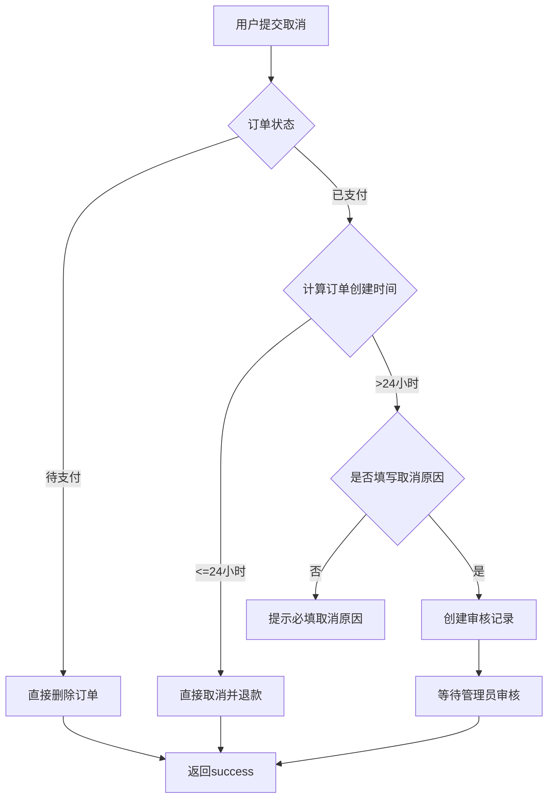

# 订单取消审核功能说明

## 📋 功能概述

商城订单取消功能改造，增加审核机制：
- **24小时内**：用户可以直接取消订单，立即退款
- **超过24小时**：需要提交审核申请，等待管理员审核通过后才能取消

---

## 🗄️ 数据库设计

### 新增表：`ba_shop_order_cancel_review`

| 字段名 | 类型 | 说明 |
|--------|------|------|
| id | int unsigned | 主键ID |
| order_id | int unsigned | 订单ID |
| order_no | varchar(50) | 订单号 |
| user_id | int unsigned | 用户ID |
| cancel_reason | varchar(500) | 取消原因 |
| order_create_time | int | 订单创建时间 |
| apply_time | int | 申请时间 |
| status | tinyint | 审核状态：0=待审核，1=已通过，2=已拒绝 |
| audit_time | int | 审核时间 |
| audit_admin_id | int | 审核管理员ID |
| audit_remark | varchar(500) | 审核备注 |
| create_time | int | 创建时间 |
| update_time | int | 更新时间 |

**索引**：
- PRIMARY KEY (`id`)
- KEY `idx_order_id` (`order_id`)
- KEY `idx_user_id` (`user_id`)
- KEY `idx_status` (`status`)
- KEY `idx_apply_time` (`apply_time`)

---

## 🔧 API接口修改

### `/api/shopOrder/cancel` - 取消订单

#### 请求参数

| 参数 | 类型 | 必填 | 说明 |
|------|------|------|------|
| order_id | int | 是 | 订单ID |
| cancel_reason | string | 条件必填 | 取消原因（超过24小时必填） |

#### 返回参数

| 参数 | 类型 | 说明 |
|------|------|------|
| order_no | string | 订单号 |
| order_id | int | 订单ID |
| status | string | 订单状态或审核状态 |
| need_review | bool | 是否需要审核 |
| review_id | int | 审核记录ID（need_review=true时返回） |

#### 业务逻辑



#### 示例

**24小时内取消**：
```json
{
  "code": 1,
  "msg": "订单取消成功，已退款到您的账户（24小时内免审核）",
  "data": {
    "order_no": "SO202601140001",
    "order_id": 123,
    "status": "cancelled",
    "need_review": false
  }
}
```

**超过24小时**：
```json
{
  "code": 1,
  "msg": "订单取消申请已提交，等待管理员审核",
  "data": {
    "order_no": "SO202601140001",
    "order_id": 123,
    "status": "pending_review",
    "need_review": true,
    "review_id": 456
  }
}
```

---

## 🎨 后台管理功能

### 菜单位置

```
商城管理
  └─ 订单管理
  └─ 订单取消审核 ✨新增
      ├─ 查看
      ├─ 详情
      ├─ 审核通过
      └─ 审核拒绝
```

### 控制器：`OrderCancelReview.php`

**路径**：`app/admin/controller/shop/OrderCancelReview.php`

#### 主要方法

| 方法 | 说明 | 权限 |
|------|------|------|
| index() | 审核列表 | shop/orderCancelReview/index |
| detail() | 查看详情 | shop/orderCancelReview/detail |
| approve() | 审核通过 | shop/orderCancelReview/approve |
| reject() | 审核拒绝 | shop/orderCancelReview/reject |

#### 审核通过流程

1. 检查审核记录状态（必须是待审核）
2. 检查订单状态（必须是已支付）
3. 根据支付方式退款到用户账户
   - 余额支付：退回 `balance_available`
   - 消费金支付：退回 `score`
4. 更新订单状态为 `cancelled`
5. 更新审核记录状态为 `已通过`
6. 记录相关日志（余额/积分日志、活动日志）

#### 审核拒绝流程

1. 检查审核记录状态（必须是待审核）
2. 必须填写拒绝原因
3. 更新审核记录状态为 `已拒绝`
4. 订单保持原状态（不做任何退款操作）
5. 记录活动日志

### 前端页面

**路径**：`web/src/views/backend/shop/orderCancelReview/index.vue`

#### 功能特性

1. **统计卡片**
   - 待审核数量
   - 已通过数量
   - 已拒绝数量

2. **数据列表**
   - 审核ID
   - 订单号
   - 用户信息（昵称、手机号）
   - 订单金额（区分余额/消费金）
   - 支付方式
   - 取消原因
   - 订单时长（从创建到申请的小时数）
   - 审核状态（待审核/已通过/已拒绝）
   - 申请时间
   - 审核时间
   - 审核人

3. **搜索功能**
   - 快速搜索：订单号、ID
   - 高级搜索：审核状态、申请时间范围

4. **操作按钮**
   - **详情**：查看完整的审核信息和订单信息
   - **审核通过**：仅待审核状态可见
   - **审核拒绝**：仅待审核状态可见

#### 审核对话框

**审核通过**：
- 显示订单号、用户、取消原因、订单金额、申请时间
- 可选填写审核备注
- 确认后立即退款并更新订单状态

**审核拒绝**：
- 显示订单号、用户、取消原因、订单金额、申请时间
- **必须填写**拒绝原因
- 确认后仅更新审核记录，订单不变

---

## 📊 数据流转

### 用户端流程

```
用户查看订单详情
    ↓
点击"取消订单"
    ↓
判断订单创建时间
    ├─ ≤24小时：立即取消，退款到账
    └─ >24小时：提示填写取消原因
              ↓
          提交审核申请
              ↓
          等待管理员审核
              ├─ 通过：退款到账，订单取消
              └─ 拒绝：查看拒绝原因，订单保持
```

### 管理员端流程

```
登录后台
    ↓
商城管理 > 订单取消审核
    ↓
查看待审核列表
    ↓
点击"详情"查看完整信息
    ↓
判断是否合理
    ├─ 合理：点击"审核通过"，填写备注（可选），确认
    │        → 系统自动退款，订单状态改为已取消
    └─ 不合理：点击"审核拒绝"，填写拒绝原因（必填），确认
             → 审核记录标记为已拒绝，订单保持原状态
```

---

## 🔍 审核规则建议

### 通过条件

1. ✅ 商家发货前（订单状态为已支付但未发货）
2. ✅ 取消原因合理（如：不需要了、价格问题、商品信息错误等）
3. ✅ 无明显恶意取消行为

### 拒绝条件

1. ❌ 商家已发货（订单状态为已发货）
2. ❌ 取消原因不合理或明显是恶意操作
3. ❌ 用户频繁取消订单（可通过系统查询该用户历史）
4. ❌ 特殊商品或活动商品不支持取消

---

## 📝 日志记录

### 余额/消费金日志

**表**：`ba_user_money_log` / `ba_user_score_log`

- **业务类型**：`shop_order_cancel_review`
- **批次号**：`SHOP_ORDER_CANCEL_REVIEW_订单ID`
- **备注**：商城订单取消审核通过退款

### 活动日志

**表**：`ba_user_activity_log`

**申请时**：
- **action_type**：`shop_order_cancel_apply`
- **remark**：提交订单取消审核申请

**审核通过**：
- **action_type**：`shop_order_cancel_review_approved`
- **remark**：订单取消审核通过，已退款

**审核拒绝**：
- **action_type**：`shop_order_cancel_review_rejected`
- **remark**：订单取消审核被拒绝

---

## 🎯 使用场景

### 场景1：正常取消（24小时内）

**用户**：刚下单就发现选错了商品
- 操作：直接点击取消订单
- 结果：立即取消，退款到账

### 场景2：延迟取消（超过24小时）

**用户**：下单2天后不想要了
- 操作：点击取消订单，填写原因"不需要了"
- 结果：提交审核，等待管理员处理

### 场景3：审核通过

**管理员**：查看审核列表，发现订单还未发货，取消原因合理
- 操作：点击"审核通过"，填写备注"订单未发货，同意取消"
- 结果：系统自动退款，订单状态改为已取消

### 场景4：审核拒绝

**管理员**：查看审核列表，发现订单已发货
- 操作：点击"审核拒绝"，填写原因"订单已发货，无法取消"
- 结果：审核记录标记为已拒绝，订单保持已发货状态

---

## ⚠️ 注意事项

1. **时间判断**：基于订单的 `create_time` 字段，精确到秒
2. **重复申请**：同一订单只能有一个待审核的取消申请
3. **订单状态**：只有 `pending`（待支付）和 `paid`（已支付）状态可以取消
4. **退款方式**：按原支付方式退回（余额/消费金）
5. **权限控制**：审核功能需要相应的后台权限
6. **日志完整性**：所有操作都有完整的日志记录

---

## 🚀 部署说明

### 1. 数据库迁移

```sql
CREATE TABLE IF NOT EXISTS `ba_shop_order_cancel_review` (
  `id` int(11) unsigned NOT NULL AUTO_INCREMENT COMMENT '主键ID',
  `order_id` int(11) unsigned NOT NULL COMMENT '订单ID',
  `order_no` varchar(50) NOT NULL DEFAULT '' COMMENT '订单号',
  `user_id` int(11) unsigned NOT NULL COMMENT '用户ID',
  `cancel_reason` varchar(500) NOT NULL DEFAULT '' COMMENT '取消原因',
  `order_create_time` int(11) NOT NULL DEFAULT '0' COMMENT '订单创建时间',
  `apply_time` int(11) NOT NULL DEFAULT '0' COMMENT '申请时间',
  `status` tinyint(2) NOT NULL DEFAULT '0' COMMENT '审核状态：0=待审核，1=已通过，2=已拒绝',
  `audit_time` int(11) NOT NULL DEFAULT '0' COMMENT '审核时间',
  `audit_admin_id` int(11) NOT NULL DEFAULT '0' COMMENT '审核管理员ID',
  `audit_remark` varchar(500) NOT NULL DEFAULT '' COMMENT '审核备注',
  `create_time` int(11) NOT NULL DEFAULT '0' COMMENT '创建时间',
  `update_time` int(11) NOT NULL DEFAULT '0' COMMENT '更新时间',
  PRIMARY KEY (`id`),
  KEY `idx_order_id` (`order_id`),
  KEY `idx_user_id` (`user_id`),
  KEY `idx_status` (`status`),
  KEY `idx_apply_time` (`apply_time`)
) ENGINE=InnoDB DEFAULT CHARSET=utf8mb4 COMMENT='商城订单取消审核表';
```

### 2. 添加菜单权限

后台菜单已自动添加，管理员需要：
1. 重新登录后台或刷新权限
2. 分配相应权限给需要的管理员角色
3. 菜单路径：商城管理 > 订单取消审核

### 3. 前端更新

如果前端代码单独部署：
```bash
cd web
npm run build
# 部署dist目录到前端服务器
```

---

## 📞 技术支持

如有问题，请联系开发团队或查看相关日志：
- API日志：`runtime/log/`
- 错误日志：查看返回的错误信息
- 数据库日志：查看相关表的记录

---

**文档版本**：1.0  
**最后更新**：2026-01-14  
**开发人员**：AI Assistant
